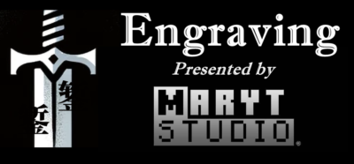

# Engraving



-----------------

## Overview

Engraving is a simple tweak utility for SlashBlade mod.

Currentyly Engraving has features below:

## Tweak Features

All wood fences (whose item has `fenceWood` oredict) can be turned into Blade Stand, not only the oak one.
Breaking the Blade Stand will drop the original fence.
Proudsoul items can be crafted from materials with different enchantments now, while the result item will have no enchantment.

## CraftTweaker Expansion

### New CraftTweaker event 

Engraving adds a new CraftTweaker event: `EntityStylishChangeEvent`. It fires when your Stylish Rank changes.

(The capital letter shown on the screen when you are in combat is your Stylish Rank, from D to SSS.)

```zenscript
import mods.engraving.event.EntityStylishChangeEvent;
```

It extends `IEntityEvent`.

`event.entity` is the entity whose Stylish Rank changes (it is most possibly the player). 

`event.amount` is both `ZenGetter` and `ZenSetter`, to get/set the Stylish Rank points as integer.

`event.reason` is a string representing the reason why Stylish Rank changes.

It has 3 possible result:

"DropLongTime" -> `event.entity` is attacked and more than a specified threshold of time has passed since the player's last rating update.

"DropShortTime" -> `event.entity` is attacked and less than a specified threshold of time has passed since the player's last rating update.

"" -> Other reason.

### `IItemDefinition` Expansion (From v1.4)

Engraving extends `IItemDefinition` and adds these new ZenMethods below:

- `isSlashBlade()` 
  - return true if this item is a SlashBlade.
- `isSlashBladeTLS()`
  - return true if this item is a SlashBlade from The Last Smith mod.
  - This method needs The Last Smith mod to be present. As you think, The Last Smith mod is a soft dependency of Engraving now, while it **should be optional**; if not, it would be a bug and please report it to me.)
- `isTools(isAxeIncluded as bool)`
  - return true if this item is a Pickaxe, Spade, or Hoe.
  - If you consider Axes are tools, feed this method a `true`, and it will return `true` when this item is an Axe.
- `isWeapons(isAxeIncluded as bool)`
  - return true if this item is a Sword.
  - If you consider Axes are weapons, feed this method a `true`, and it will return true when this item is an Axe.
- `isArmor()`
  - return true if this item is a piece of Armor.
- `isAxes()`
  - return true if this item is an Axe.

With these ZenMethods, you can easily determine if an IItemStack in your ZenScript is a certain type of players' equipments.